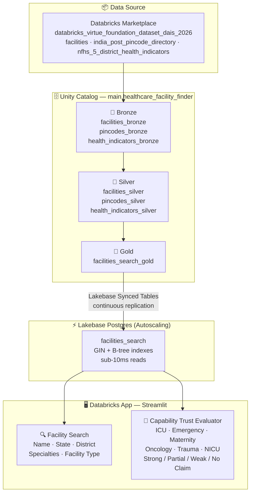

# Healthcare Facility Finder

A comprehensive healthcare facility locator application built with Databricks medallion architecture, Lakebase for sub-10ms searches, and a modern Streamlit web interface.

## 📊 Data Source

**Databricks Virtue Foundation Dataset (DAIS 2026)**
- Catalog: `databricks_virtue_foundation_dataset_dais_2026`
- Schema: `virtue_foundation_dataset`
- Tables:
  - `facilities` (10,088 rows) - Healthcare facilities with location, services, specialties
  - `india_post_pincode_directory` - Geographic pincode lookup
  - `nfhs_5_district_health_indicators` - District health statistics

## 🏗️ Architecture

**Target Schema:** `main.healthcare_facility_finder`



## 📁 Project Structure

```
Data-AVengers/
├── notebooks/
│   ├── 00_setup_and_config.py          # UC schema + Lakebase setup
│   ├── 01_bronze_ingestion.py          # Raw data ingestion
│   ├── 02_silver_transformation.py     # Data cleaning
│   ├── 03_gold_curation.py             # Search optimization + Lakebase sync
│   └── 04_deploy_app.py                # Deploy Streamlit app
│
├── app/
│   ├── app.py                          # Streamlit facility finder UI
│   ├── app.yaml                        # App configuration
│   └── requirements.txt                # Python dependencies
│
└── README.md                           # This file
```

## 📒 Notebooks — Quick Summary

- `00_setup_and_config.py`: Creates Unity Catalog schema (`main.healthcare_facility_finder`), sets configuration widgets, and provides Lakebase provisioning instructions and next steps.
- `01_bronze_ingestion.py`: Ingests raw marketplace tables into bronze UC tables (`*_bronze`) and adds ingestion metadata.
- `02_silver_transformation.py`: Cleans, standardizes, deduplicates bronze tables and writes `*_silver` tables with data-quality flags.
- `03_gold_curation.py`: Builds search-optimized `facilities_search_gold` view, provides Lakebase SQL and sync instructions, and index recommendations.
- `04_deploy_app.py`: Verifies app files, assists with service-principal and UC permission setup, and deploys the Streamlit app to Databricks Apps.

## Next Steps

- Run notebooks in order: `00_setup_and_config.py` → `01_bronze_ingestion.py` → `02_silver_transformation.py` → `03_gold_curation.py` → `04_deploy_app.py`.
- Provision a Lakebase instance and run the SQL in `03_gold_curation.py` to enable sub-10ms searches.
- After first app deployment, re-run `04_deploy_app.py` to grant Unity Catalog permissions to the app service principal.

## 🚀 Quick Start

### 1. Run Setup

Open and run: `notebooks/00_setup_and_config.py`
- Creates Unity Catalog schema: `main.healthcare_facility_finder`
- Provides Lakebase instance setup instructions

### 2. Build Bronze Layer

Run: `notebooks/01_bronze_ingestion.py`
- Ingests raw data from marketplace catalog
- Creates bronze tables with full schema

### 3. Build Silver Layer

Run: `notebooks/02_silver_transformation.py`
- Cleans and standardizes data
- Handles nulls, data types, and validation

### 4. Build Gold Layer & Sync to Lakebase

Run: `notebooks/03_gold_curation.py`
- Creates search-optimized views
- Sets up continuous sync to Lakebase
- Configures indexes for fast queries

### 5. Deploy Application

Run: `notebooks/04_deploy_app.py`
- Deploys Streamlit app to Databricks Apps
- Configures app service principal permissions
- Provides app URL for testing

## 🎯 Key Features

### Application Features
- **Smart Search**: Find facilities by name, location, services, specialties
- **Geographic Filters**: Search by state, district, pincode
- **Service Categories**: Filter by facility type, operator, specialties
- **Contact Information**: Phone, email, website, address
- **Real-time Data**: Powered by Lakebase with sub-10ms response times
- **Capability Trust Evaluator**: Evaluate ICU, Emergency, Maternity, Oncology, Trauma, and NICU claims per facility — rated Strong, Partial, Weak, or No Claim based on specialty keyword frequency and facility type

### Technical Features
- **Medallion Architecture**: Bronze → Silver → Gold data layers
- **Unity Catalog**: Governed, versioned tables
- **Lakebase Sync**: Continuous replication from UC to Postgres
- **Sub-10ms Queries**: Lakebase-backed facility search
- **Databricks Apps**: Secure, serverless app hosting
- **Modern UI**: Streamlit with custom styling

## 📝 Configuration

Edit configuration in `notebooks/00_setup_and_config.py`:

```python
SOURCE_CATALOG = "databricks_virtue_foundation_dataset_dais_2026"
SOURCE_SCHEMA = "virtue_foundation_dataset"
TARGET_CATALOG = "main"
TARGET_SCHEMA = "healthcare_facility_finder"
APP_NAME = "healthcare_facility_finder"
```

## 🔒 Security & Permissions

The deployment notebook (`04_deploy_app.py`) automatically:
- Creates app service principal
- Grants SELECT on all gold tables
- Grants Lakebase connection permissions
- Configures secure app access

## 🛠️ Development

### Requirements
- Databricks workspace (AWS/Azure/GCP)
- Unity Catalog enabled
- Lakebase instance provisioned
- SQL Warehouse for notebook execution

### Deployment
```bash
# All deployment handled via notebooks
# No local CLI required - pure Databricks-native
```

## 📊 Data Quality

Each layer includes data quality checks:
- **Bronze**: Schema validation, row counts
- **Silver**: Null handling, data type validation
- **Gold**: Business rule validation, search optimization

## 🤝 Team: Data-AVengers

Built for Databricks Hackathon with the Virtue Foundation dataset.

## 📄 License

This project uses the Databricks Virtue Foundation Dataset (DAIS 2026) under marketplace terms.